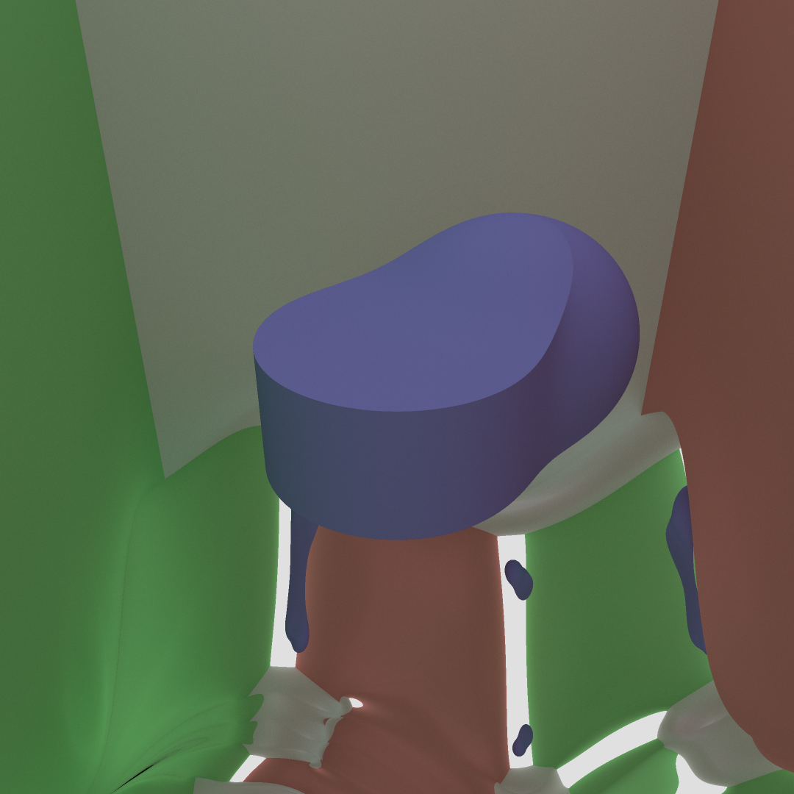

# raytrace
A simple sphere marching renderer

The name comes from when it was actually raytracing

## Examples
See `prod` folder  

## Building
Requires a C++ compiler with at least c++11 support, and Qt (both the headers and the libraries)

### With make
Build it with `make`

### Without make
- Copy all sources into a QtCreator project and compile like that
- Or any method you usually use to compile a C++/Qt project
